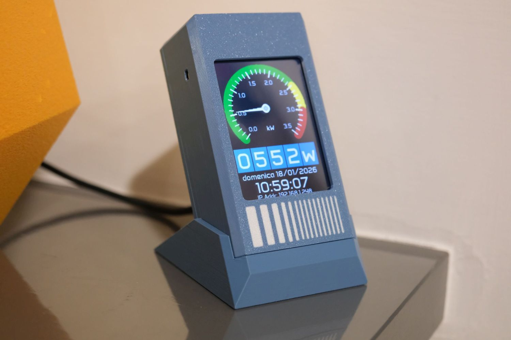

# Unihiker M10 HMI Power Meter Gauge

### 

### Introduction

In Italy we have a common issue with the electricity supply: every house has a power meter that automatically cuts off the power if the total load in the home is greater than 3kW + 10% (3.3kW)

>  We have a voltage of 220÷240VAC, so this means your home appliances can draw a maximum of 15A in total. There are also contracts allowing 4.5 or 6kW and so on, but the 3kW one is the most diffused among the italian domestic population. 

Due this, the meter cuts off the power very often if you simultaneously turn on two appliances requiring high current values such as a washing machine + oven or an hairdryer + the dishwasher and so on.  This means you have to go out every time to reset the meter, which is really annoying.

Lot of time ago I engineered a smart-home system in my house, I improved it over years and it runs entirely on [Node-Red](https://nodered.org/) , [Mosquitto ](https://mosquitto.org/) and [Tasmota](https://tasmota.github.io/docs/). I have all the high-current demand appliances connected through their own smart plugs: this allows me to turn them on/off and measure the current load for each device. 

Recently I added a (sponsored link) [Nous D3T current meter](https://amzn.to/4aXbdN5) at the top of the electrical system so I can make the system raise an alarm when the total power consuption is near the limit: in this case I can detach a device and I could do this also automatically through node-red, since I know which appliances are drawing power through the smart plugs. 

Alarm is rised through a buzzer attached to the Raspberry Pi running Node-Red and also through a Telegram message using a bot. But... the Raspberry Pi is located in my laboratory and Telegram bot sometimes don't works properly and messages are sent lot of time after the alarm occurred.

I thought to build a small smart device showing the actual current load, and I used an [Unihiker M10](https://www.unihiker.com/products/m10) . The Unihiker M10 has a 320x240px color display, is powerful and runs on Debian, so you can use  python directly (not *Micropython* or *Circuitpython*) with powerful graphical libraries (such as the one I used: [pygame](https://www.pygame.org/wiki/about)). 

The power load value is taken from an MQTT topic directly from the current meter or from a Node-Red generated topic. Result is very cool and you have a sound alarm if the limit is reached: so this gadget is very useful to be placed wherever you want (I placed it in the kitchen, where the great part of high current demand appliances is located)

### Enclosure design

I designed the enclosure using Onshape. I spent lot of time and effort for having a functional and cute enclosure. Actually the enclosure is made of 3 parts: the main body, a lid, and a cradle that allows to have the Unihiker M10 slightly tilted backwards allowing a better view of the display.

I shared all info about the enclosure, 3mf file for Bambulab 3D-Printers and STL files on my makerworld page. You can find it here: 

[Unihiker M10 enclosure for HMI Gauge](https://makerworld.com/it/models/2261736-unihiker-m10-enclosure-for-hmi-gauge)

[In this video](https://www.instagram.com/reel/DTvF3isiuHZ/) I show how the enclosure is intended to be assembled.

### Code Setup

1. Copy the entire *gauge_hmi* folder of the repo on your computer in order to prepare files.  
2. Paste in the *gauge_hmi/assets* folder the font file `Anta-Regular.ttf` (you can download it from [Google Fonts](https://fonts.google.com/specimen/Anta)).
3. Paste in the *gauge_hmi/assets* folder a your own png splash image having a resolution of 240x320 pixels. The name of this file is contained in `config.py` and default is `splash_240x320.png`
4. Copy the file `credentials.py` as `mycredentials.py` and then edit it by writing your own Wi-Fi SSID and Password and MQTT Broker Address, User and Password  

> I was not able to connect to my own MQTT Broker having user and password, I was able to connect only when I removed the password. I don't understand if it was my own problem or a code issue but you know: if you've problem connecting your MQTT broker... try to remove user and password.

5. Edit `config.py` by changing MQTT parameters and all other parameters for suit your own needs (keep always an original copy of config.py)
6. Edit `mqtt_client.py` for using the right function for obtaining the value to display: more info in the *editing the mqtt client function* chapter below 
7. Transfer the entire *gauge_hmi* folder on the unihiker *home/* folder.  I like to use WinSCP for transferring files. Default user/password on Unihiker are root/admin and local address, when connected to the PC, is 10.1.2.3
8. The file `hmi_launcher.py` contained in repo *root* has to be copied in *root/* folder on the unihiker.  
9. Follow the instructions in [unihiker/root/README.md](unihiker/root/README.md) for achieving the autostart of the HMI gauge on Unihiker boot.  

### Editing the MQTT Client function
There are 2 functions in `mqtt_client.py` having the same name: `_on_message`. One has to be commented and the other not. This function is automatically called for retrieving the value to be displayed when a message is received from the subscripted topic. Instructions are reported in the file itself starting from the row #53:   
  
The first defined function is used when the subscribed topic gives a payload containing only one value.  So, for example, I'll receive the value on a topic like `house_total_power` or `power\meter` and so on, and there is only ONE value: no JSON, no arrays. Only a numeric value from the topic.  
  
The second function has to be used when the payload is a JSON object and so the value is contained in a payload key or as element of a value defined as an array. This is the case of Power Meters running on Tasmota: those meters publish on a topic called `tele/[DEVICE]/SENSOR` giving a payload like the following:  

```json
{
  "Time": "2025-03-01T21:22:24",
  "ENERGY": {
    "TotalStartTime": "2025-01-10T10:00:00",
    "Total": 1670.395,
    "Yesterday": 5.123,
    "Today": 1.456,
    "Period": 0,
    "Power": 325,
    "ApparentPower": 450,
    "ReactivePower": 310,
    "Factor": 0.72,
    "Voltage": 230,
    "Current": 1.956
  }
}
```  
Following the above example: I want to show the actual Power: this value is contained in the `ENERGY.Power` key. The function will have the following form:  
  
```python
payload = msg.payload.decode(errors="ignore").strip()
data = json.loads(payload)
val = data["ENERGY"]["Power"]
```

Another example is a value contained in an array element, for example a payload like this:
```json
{
  "values": [432, 325, 766]
}
```
  
I know that value I want to show is the second element of that array (325 in the above example), so the function will have the following form:
  
```python
payload = msg.payload.decode(errors="ignore").strip()
data = json.loads(payload)
myval = data['values'][1]
```

Comment/Uncomment the various section of code for achieving what you want, by default is active the code part made for tasmota power meters.

### Source Code

in progress
